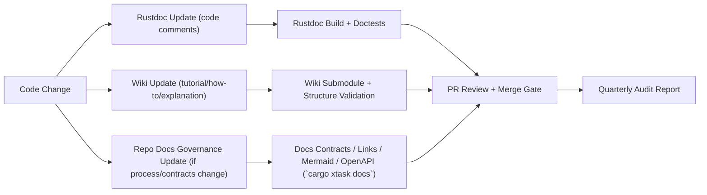

# Explanation: Documentation Architecture and Governance

## Why Diataxis is enforced

Diataxis prevents category drift. Without hard boundaries, reference pages become tutorials, SOPs become explanations, and operational reliability degrades because users cannot tell whether a page is normative or informative.

## Why Documentation-as-Code is enforced

Documentation failures are production failures when they cause incorrect operations, invalid assumptions, or delayed recovery. Co-locating docs with code ensures behavioral changes and knowledge changes travel together.

## Why frontmatter contracts exist

Ownership, lifecycle status, and invariants are governance signals. They enable automated freshness checks, review routing, and long-horizon maintainability.

## Why the rustdoc + Wiki split exists

Different documentation intents age at different rates:

- API signatures and type contracts change with code and should be generated directly from code comments (`rustdoc`).
- Tutorials/how-to/explanations need faster editing, lighter navigation, and reader-centric page organization (GitHub Wiki).
- Governance and operational controls (contracts, SOPs, ADRs, local verification design) belong in the main repo and remain machine-validated via the Rust `xtask` docs tooling.

This split reduces duplication while preserving reviewability.

## Failure modes this system addresses

- Orphaned procedures with no owner
- Stale recovery docs that still pass manual review
- Mixed intent pages (tutorial + reference + explanation in one file)
- Drift between hand-written API reference and real code
- Wiki pages that describe workflows but are not reviewed with code changes
- Broken internal links after refactors
- Diagram drift when screenshots replace source diagrams

## Evolution strategy

- Expand generated references as the codebase grows (rustdoc, OpenAPI, CLI help, schema exports).
- Expand ownership vocabulary and CODEOWNERS mapping when teams formalize.
- Feed audit reports into dashboards for trend analysis.

## Architecture Diagram

