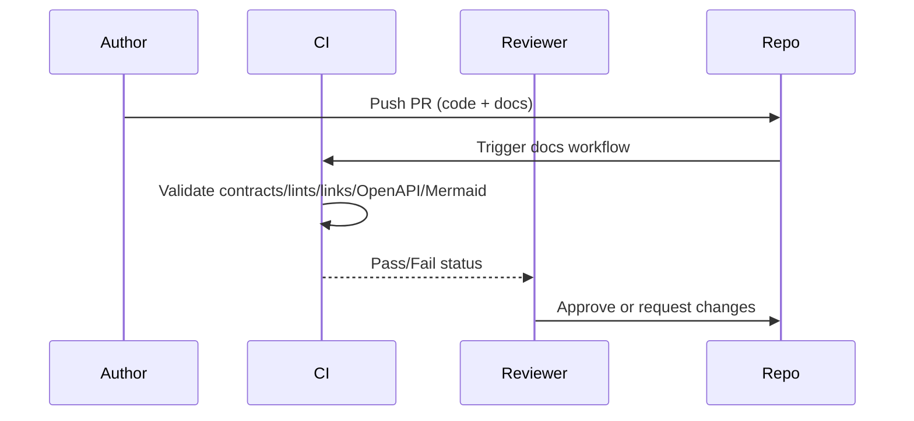

# SOP: Documentation System Operation and Governance

## 1. Title & Purpose

This SOP defines the procedure for authoring, validating, reviewing, and auditing project documentation without violating documentation governance invariants.

## 2. Scope

- Covers: Diataxis-classified docs, ADRs, SOPs, OpenAPI assets, Mermaid diagrams, and CI validation
- Does not cover: runtime application behavior, non-repository knowledge bases, or third-party documentation sites

## 3. Roles & Responsibilities

| Role | Responsibility |
| --- | --- |
| Author | Creates or updates documentation in the same repository/PR as related changes |
| Reviewer | Verifies correctness, category fit, and postconditions |
| Architecture Owner | Approves structural changes, ADRs, and governance deviations |
| Platform Team | Maintains CI/documentation tooling and audit workflows |

## 4. Prerequisites

- Repository checkout with `python3`
- Ability to run repository validation scripts
- Required ownership and status values known
- Related code/API/architecture changes identified (if applicable)

## 5. Step-by-Step Procedure

1. Classify the change by intent (`tutorial`, `how-to`, `reference`, `explanation`, `adr`, `sop`).
   - Command:

   ```bash
   ls docs
   ```

   - Expected output: category directories exist under `docs/`
   - Failure condition: content intent is unclear or spans multiple categories
2. Create or update the document with valid frontmatter and invariants.
   - Command:

   ```bash
   $EDITOR docs/<category>/<file>.md
   ```

   - Expected output: file contains required frontmatter and appropriate category content
   - Failure condition: missing metadata, mixed intent, or no owner assigned
3. Add/update related contracts (ADR, OpenAPI, diagrams) when architecture/API changes.
   - Command:

   ```bash
   python3 scripts/docs/validate_docs.py openapi
   ```

   - Expected output: OpenAPI assets validate or no specs are present
   - Failure condition: schema invalid or spec missing for a changed public API
4. Run documentation validation locally.
   - Command:

   ```bash
   python3 scripts/docs/validate_docs.py all
   ```

   - Expected output: all validation stages report success
   - Failure condition: frontmatter/link/SOP/diagram validation fails
5. Submit a pull request and complete documentation checklist items.
   - Command:

   ```bash
   git status --short
   ```

   - Expected output: docs changes are included with related code changes
   - Failure condition: behavioral code change ships without docs update or ADR requirement is skipped

## 6. Visual Aids



## 7. Invariants (Critical Section)

- Documentation remains in the same repository as source code.
- Critical procedures include explicit invariants and validation checklists.
- `category` matches folder placement.
- `owner`, `status`, and `last_reviewed` remain machine-validated.
- Diagrams are source-controlled (Mermaid) rather than screenshots.

## 8. Validation Checklist

- [ ] Frontmatter contract passes
- [ ] Internal links resolve
- [ ] Mermaid blocks validate
- [ ] OpenAPI specs validate (if present/changed)
- [ ] MkDocs site builds
- [ ] PR checklist completed (docs updated / ADR if required)

## 9. Version History

| Version | Date | Author | Change |
| --- | --- | --- | --- |
| 1.0.0 | 2026-02-25 | Codex | Initial documentation system SOP |

