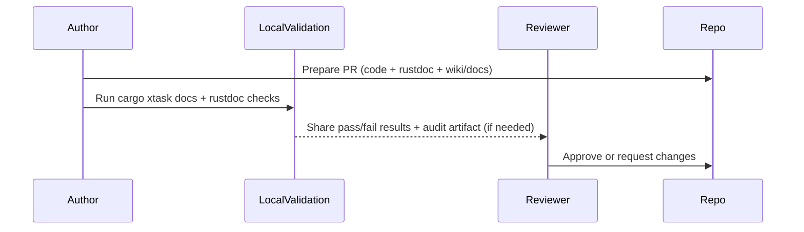

# SOP: Documentation System Operation and Governance

## 1. Title & Purpose

This SOP defines the procedure for authoring, validating, reviewing, and auditing project documentation across rustdoc, the GitHub Wiki submodule, and the `docs/` governance corpus without violating documentation governance invariants.

## 2. Scope

- Covers: rustdoc API reference comments, GitHub Wiki tutorials/how-to/explanations, `docs/` governance pages, ADRs, SOPs, OpenAPI assets, Mermaid diagrams, and local validation
- Does not cover: runtime application behavior itself, external third-party documentation sites, or non-versioned documentation channels

## 3. Roles & Responsibilities

| Role | Responsibility |
| --- | --- |
| Author | Creates or updates rustdoc/wiki/docs documentation in the same review cycle as related changes |
| Reviewer | Verifies correctness, surface placement (rustdoc vs wiki vs `docs/`), and postconditions |
| Architecture Owner | Approves structural changes, ADRs, and governance deviations |
| Platform Team | Maintains local documentation tooling and audit workflows |

## 4. Prerequisites

- Repository checkout with Rust toolchain (`cargo`)
- Repository checkout with the `wiki/` submodule available locally
- Ability to run repository validation scripts
- Required ownership and status values known
- Related code/API/architecture changes identified (if applicable)

## 5. Step-by-Step Procedure

1. Classify the change by intent and documentation surface (`rustdoc`, GitHub Wiki, `docs/` ADR/SOP/reference pages).
   - Command:

   ```bash
   cargo wiki status
   ```

   - Expected output: `wiki/` submodule branch/HEAD/dirty state is visible before editing
   - Failure condition: `wiki/` is unavailable locally or state is unclear
   - If the submodule is missing and you are not already carrying local wiki edits, initialize or refresh it with `cargo wiki sync`.
   - If editing wiki content: after `cargo wiki status`, run `git -C wiki fetch origin`, then fast-forward the local wiki branch (or switch off detached HEAD before committing).
2. Create or update the documentation in the correct place.
   - Command:

   ```bash
   $EDITOR crates/<crate>/src/<file>.rs   # rustdoc
   $EDITOR wiki/<Page>.md                 # GitHub Wiki
   $EDITOR docs/<category>/<file>.md      # repo docs governance/ADR/SOP
   ```

   - Expected output: API reference docs are in rustdoc; tutorials/how-to/explanations are in wiki; governance docs remain in `docs/`
   - Failure condition: wrong surface, missing rustdoc update, or mixed intent page
3. Add/update related contracts (ADR, OpenAPI, diagrams) when architecture/API/process changes.
   - Command:

   ```bash
   cargo xtask docs openapi
   ```

   - Expected output: OpenAPI assets validate or no specs are present
   - Failure condition: schema invalid or spec missing for a changed public API
4. Run documentation validation locally.
   - Command:

   ```bash
   cargo xtask docs all
   cargo doc --workspace --no-deps
   cargo test --workspace --doc
   ```

   - Expected output: wiki/docs validation and rustdoc build/doctests report success
   - Failure condition: wiki structure, frontmatter/link/SOP/diagram validation, rustdoc warnings, or doctests fail
5. Submit a pull request and complete documentation checklist items.
   - Command:

   ```bash
   git status --short
   ```

   - Expected output: code changes plus rustdoc/wiki/docs updates (and `wiki/` submodule pointer when applicable) are included
   - Failure condition: behavioral code change ships without rustdoc/wiki updates, wiki changes are committed without a parent submodule pointer update, or ADR requirement is skipped
   - Record the docs surfaces updated, commands run, and any intentionally skipped checks in the PR description or review notes used by the repository workflow.

## 6. Visual Aids



## 7. Invariants (Critical Section)

- Documentation remains in the same repository as source code.
- Rust API reference remains generated from rustdoc, not duplicated as hand-maintained Markdown reference.
- Tutorials/how-to/explanations are maintained in the GitHub Wiki (`wiki/` submodule).
- Critical procedures include explicit invariants and validation checklists.
- `category` matches folder placement.
- `owner`, `status`, and `last_reviewed` remain machine-validated.
- Diagrams are source-controlled (Mermaid) rather than screenshots.

## 8. Validation Checklist

- [ ] Frontmatter contract passes
- [ ] Wiki submodule and structure checks pass
- [ ] Rustdoc builds with no warnings
- [ ] Rustdoc examples/doctests pass
- [ ] Internal links resolve
- [ ] Mermaid blocks validate
- [ ] OpenAPI specs validate (if present/changed)
- [ ] `cargo xtask docs all` passes
- [ ] PR description or review notes record docs coverage and ADR status when required

## 9. Version History

| Version | Date | Author | Change |
| --- | --- | --- | --- |
| 1.2.3 | 2026-03-01 | Codex | Switched initial wiki inspection to `cargo wiki status` and replaced missing PR-template references with workflow-note guidance |
| 1.2.2 | 2026-02-28 | Codex | Standardized wiki submodule bootstrap/inspection on `cargo wiki sync` and `cargo wiki status` |
| 1.2.1 | 2026-02-26 | Codex | Added explicit wiki submodule sync/refresh procedure and clarified wiki pointer update failure mode |
| 1.2.0 | 2026-02-26 | Codex | Migrated documentation validation/audit workflow to Rust-only `xtask`; removed hosted CI/MkDocs runtime dependency |
| 1.1.0 | 2026-02-26 | Codex | Added rustdoc + GitHub Wiki split workflow, validation, and review requirements |
| 1.0.0 | 2026-02-25 | Codex | Initial documentation system SOP |
