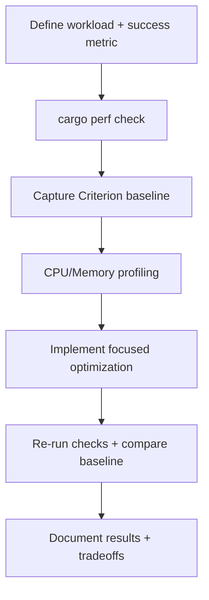

# SOP: Performance Engineering and Regression Validation

## 1. Title & Purpose

This SOP defines the project procedure for profiling, benchmarking, optimizing, and validating performance-sensitive changes without violating functional correctness or maintainability requirements.

## 2. Scope

- Covers: local performance preflight checks, Criterion baseline capture/comparison, CPU profiling (`cargo flamegraph`, `perf`), memory profiling (`heaptrack` or equivalent), optimization validation, and documentation of results/tradeoffs
- Does not cover: production SLO alerting/telemetry operations, hosted benchmark infrastructure implementation, or platform-specific profiler installation procedures beyond command references

## 3. Roles & Responsibilities

| Role | Responsibility |
| --- | --- |
| Engineer/Author | Defines workload hypothesis, runs benchmarks/profilers, implements minimal optimization, and records results |
| Reviewer | Verifies measurement quality, correctness validation, and tradeoff justification |
| Platform Team | Maintains `cargo xtask perf` workflow commands and performance documentation |
| Architecture Owner | Approves exceptions when performance changes significantly reduce readability/portability or alter architectural boundaries |

## 4. Prerequisites

- Repository checkout with Rust toolchain (`cargo`)
- Workspace builds/tests locally
- Optional profiling tools installed as needed (`cargo flamegraph`, `perf`, `heaptrack`)
- Target workload identified (CPU-bound, memory-bound, concurrency-bound, I/O-bound, or WASM/browser path)
- Baseline comparison name chosen for the current optimization session (for Criterion-based benches)

## 5. Step-by-Step Procedure

1. Define the workload and success criteria before changing code.
   - Command:

   ```bash
   cargo perf doctor
   ```

   - Expected output: local tooling availability report (`cargo` present; optional profilers marked available/missing)
   - Failure condition: required Rust tooling missing or benchmark/profiler requirements unclear
2. Run correctness preflight and benchmark target compile checks.
   - Command:

   ```bash
   cargo perf check
   ```

   - Expected output: workspace tests, all-features tests, doctests, and `cargo bench --no-run` succeed
   - Failure condition: any functional or benchmark compile check fails (stop and fix correctness/bench issues first)
3. Capture a benchmark baseline for the target workload (Criterion benches).
   - Command:

   ```bash
   cargo perf baseline <baseline-name> [cargo-bench-args]
   ```

   - Expected output: benchmark run completes and baseline data is written under Criterion outputs (typically `target/criterion/`)
   - Failure condition: no relevant benchmarks exist, baseline capture fails, or benchmark command is not scoped to the intended workload
4. Collect profile evidence on the baseline workload before optimizing.
   - Command:

   ```bash
   cargo perf flamegraph --bench <bench_name>
   # optional Linux low-level CPU profiling:
   perf stat cargo bench --workspace
   perf record --call-graph dwarf cargo bench --workspace
   # optional memory profiling:
   cargo perf heaptrack -- cargo bench --workspace
   ```

   - Expected output: CPU/memory hotspot data collected and artifacts saved (for example `.artifacts/perf/flamegraphs/*.svg`)
   - Failure condition: optimization begins without profile evidence for non-trivial regressions/hot paths
5. Implement the smallest change that addresses the measured bottleneck.
   - Command:

   ```bash
   git diff --stat
   ```

   - Expected output: minimal, reviewable change focused on the profiled bottleneck
   - Failure condition: large speculative refactor with no direct linkage to measured hotspot
6. Re-run correctness checks and compare against the baseline.
   - Command:

   ```bash
   cargo perf check
   cargo perf compare <baseline-name> [cargo-bench-args]
   ```

   - Expected output: correctness still passes and benchmark comparison reports the intended improvement (or acceptable regression)
   - Failure condition: correctness regressions, unstable/unexplained results, or blocking regressions vs thresholds
7. Validate scenario-specific behavior (concurrency, I/O, or WASM/browser) when applicable.
   - Command:

   ```bash
   # examples (choose applicable workload-specific checks)
   cargo test --workspace
   cargo bench --workspace
   cargo web-check
   ```

   - Expected output: affected runtime surface behaves correctly under realistic workload validation
   - Failure condition: only microbench results improve while scenario-level behavior regresses
8. Document evidence and tradeoffs in the same review cycle.
   - Command:

   ```bash
   git status --short
   ```

   - Expected output: code changes plus required rustdoc/wiki/docs updates (when behavior/operations change) are included, and PR notes include measured before/after evidence
   - Failure condition: optimization merges without reproducible commands, measurements, or tradeoff justification

## 6. Visual Aids



## 7. Invariants (Critical Section)

- Correctness validation is not skipped for performance-sensitive changes.
- Baseline and comparison commands are recorded for benchmarked optimizations.
- Non-trivial optimization work is guided by profile evidence (CPU and/or memory) rather than speculation.
- Regression thresholds from the performance reference are applied or explicitly overridden with justification.
- Readability/maintainability/portability tradeoffs are documented when materially affected.
- Wiki and repo docs are updated when performance workflows, thresholds, or operational guidance change.

## 8. Validation Checklist

- [ ] `cargo perf doctor` run (tool availability verified)
- [ ] `cargo perf check` passed before changes
- [ ] Criterion baseline captured (or exception documented)
- [ ] CPU/memory profiling evidence captured for target bottleneck
- [ ] `cargo perf check` passed after changes
- [ ] Baseline comparison run and reviewed
- [ ] Scenario-specific validation run (concurrency/I/O/WASM when applicable)
- [ ] PR notes include measured deltas and tradeoff rationale
- [ ] Relevant rustdoc/wiki/docs updates included (if behavior/process changed)

## 9. Version History

| Version | Date | Author | Change |
| --- | --- | --- | --- |
| 1.0.0 | 2026-02-26 | Codex | Initial project-wide performance engineering and regression validation SOP |
