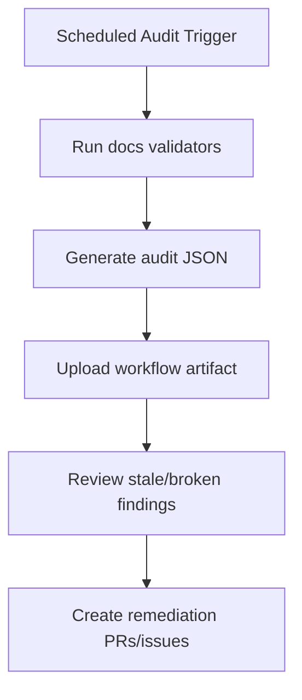

# SOP: Quarterly Documentation Audit

## 1. Title & Purpose

This SOP defines the quarterly documentation audit procedure for verifying freshness, structural integrity, and CI health of project documentation.

## 2. Scope

- Covers: all repository documentation under `docs/`, CI workflow health, and generated audit artifacts
- Does not cover: runtime production incident review processes or application SLO audits

## 3. Roles & Responsibilities

| Role | Responsibility |
| --- | --- |
| Platform Team | Runs the audit and preserves artifacts |
| Reviewers | Resolve assigned stale/broken documentation findings |
| Architecture Owner | Approves exceptions and lifecycle changes |

## 4. Prerequisites

- Repository access
- CI permissions to view workflow artifacts
- `python3`
- Current branch synchronized with `main`

## 5. Step-by-Step Procedure

1. Run the documentation audit report locally or via CI.
   - Command:

   ```bash
   python3 scripts/docs/validate_docs.py audit-report --output .artifacts/docs-audit.json
   ```

   - Expected output: JSON audit report written to `.artifacts/docs-audit.json`
   - Failure condition: validation errors prevent report generation
2. Review stale document list and assign owners.
   - Command:

   ```bash
   python3 scripts/docs/validate_docs.py frontmatter
   ```

   - Expected output: frontmatter freshness passes or outputs actionable stale docs
   - Failure condition: stale critical SOP/reference docs remain unresolved
3. Re-run full validation and docs build.
   - Command:

   ```bash
   python3 scripts/docs/validate_docs.py all
   ```

   - Expected output: all checks succeed
   - Failure condition: broken links, invalid diagrams, or contract failures persist
4. Archive the audit artifact in CI and record follow-up actions.
   - Command:

   ```bash
   git status --short
   ```

   - Expected output: follow-up issues/PRs are identified; no accidental artifact commits unless intended
   - Failure condition: audit closes without assigned remediation

## 6. Visual Aids



## 7. Invariants (Critical Section)

- Audit artifacts are generated and retained for each scheduled run.
- Stale `active` docs are tracked to named owners.
- Broken internal links are not ignored without an approved exception.
- Governance contract changes require ADR review.

## 8. Validation Checklist

- [ ] Audit JSON artifact generated
- [ ] Freshness percentage reviewed
- [ ] Stale docs assigned
- [ ] Broken links count is zero
- [ ] Mermaid/OpenAPI validation passes

## 9. Version History

| Version | Date | Author | Change |
| --- | --- | --- | --- |
| 1.0.0 | 2026-02-25 | Codex | Initial quarterly audit SOP |

