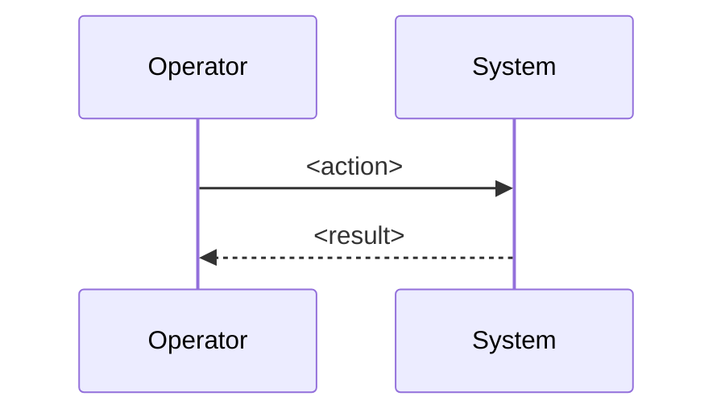

# SOP Template

## 1. Title & Purpose

This SOP defines the procedure for `<procedure>` without violating `<critical reliability constraint>`.

## 2. Scope

- Covers: `<included systems/tasks>`
- Does not cover: `<explicit exclusions>`

## 3. Roles & Responsibilities

| Role | Responsibility |
| --- | --- |
| Operator | Executes the procedure |
| Reviewer | Verifies postconditions |
| Architect | Approves deviations |

## 4. Prerequisites

- `<tool/version>`
- `<credentials/access>`
- `<maintenance window or approvals>`
- `<data integrity check>`

## 5. Step-by-Step Procedure

1. `<step>`
   - Command:

   ```bash
   <command>
   ```

   - Expected output: `<what success looks like>`
   - Failure condition: `<what requires stop/escalation>`
2. `<step>`
   - Command:

   ```bash
   <command>
   ```

   - Expected output: `<what success looks like>`
   - Failure condition: `<what requires stop/escalation>`

## 6. Visual Aids



## 7. Invariants (Critical Section)

- `<non-negotiable safety rule>`
- `<consistency rule>`
- `<data integrity rule>`

## 8. Validation Checklist

- [ ] `<postcondition>`
- [ ] `<monitoring/log condition>`
- [ ] `<business/technical verification>`

## 9. Version History

| Version | Date | Author | Change |
| --- | --- | --- | --- |
| 0.1.0 | 2026-02-25 | `<author>` | Initial draft |

