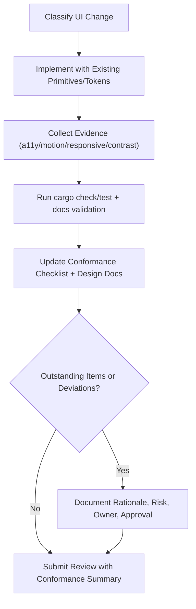

# SOP: UI Design Conformance Review (Apple HIG + Neumorphic Shell)

## 1. Title & Purpose

This SOP defines the repeatable procedure for reviewing desktop-shell and shared UI changes against Apple Human Interface Guidelines principles while applying the project token-driven shell design systems in a consistent, semantically controlled manner without violating accessibility, interaction, and documentation governance invariants.

## 2. Scope

- Covers: shell/theme CSS (`crates/site/src/theme_shell/*`), shared UI primitives (`crates/system_ui/src/*`), desktop shell components (`crates/desktop_runtime/src/components*`), shared iconography (`crates/system_ui/src/icon.rs`), and related UI design-system documentation/governance artifacts
- Covers: typography, spacing, layout hierarchy, color semantics, motion, accessibility, interaction patterns, iconography integration, responsive behavior, and component consistency
- Does not cover: app-content feature logic unrelated to shared shell UI, non-shell visual experimentation not intended for merge, or third-party native platform UI certification

## 3. Roles & Responsibilities

| Role | Responsibility |
| --- | --- |
| Author | Classifies UI change scope, updates implementation, collects evidence, and updates conformance docs/checklist |
| Reviewer | Verifies acceptance criteria, checks evidence quality, and rejects unsupported conformance claims |
| Accessibility Reviewer (or designated reviewer) | Verifies keyboard/focus/contrast/reduced-motion results for material interaction or visual changes |
| Platform Team | Maintains checklist/SOP/AGENTS governance and any local validation tooling |
| Architecture Owner | Approves intentional deviations from checklist exit criteria when documented |

## 4. Prerequisites

- Repository checkout with Rust toolchain and local build/test capability
- `wiki/` submodule initialized when wiki registry pages will be updated
- Ability to run the desktop shell locally (browser/WASM workflow used by the project)
- Current checklist available: `docs/reference/desktop-shell-hig-neumorphic-conformance-checklist.md` and `docs/reference/desktop-shell-hig-fluent-conformance-checklist.md`
- Current design-system references available: `docs/reference/desktop-shell-neumorphic-design-system.md` and `docs/reference/desktop-shell-fluent-modern-design-system.md`
- Change scope identified (token-only, visual component, interaction behavior, accessibility, iconography, responsive)

## 5. Step-by-Step Procedure

1. Classify the UI change and determine required conformance surfaces.
   - Command:

   ```bash
   git status --short
   ```

   - Expected output: changed UI files are visible and can be classified (theme CSS, shell components, icons, docs/wiki)
   - Failure condition: UI-affecting files are changed but no conformance review scope is identified
   - Required classification tags for review notes: `tokens`, `primitives`, `interaction`, `a11y`, `iconography`, `responsive`, `docs-governance`

2. Update implementation using existing shell conventions before introducing new patterns.
   - Command:

   ```bash
   rg -n "system_ui|IconName|IconSize|data-ui-kind|data-ui-slot|data-skin|data-reduced-motion|data-high-contrast|--sys-" crates/system_ui/src crates/desktop_runtime/src crates/apps crates/site/src/theme_shell
   ```

   - Expected output: existing primitives and theming hooks are easy to reuse
   - Failure condition: new UI work introduces ad hoc icon markup, bypasses `--sys-*` tokens, reintroduces legacy primitive contracts, or duplicates shared interaction patterns without justification
   - Change-control expectation: if a new primitive/state pattern is necessary, document it in the design-system reference in the same change

3. Collect implementation evidence for the conformance checklist (required for material UI changes).
   - Command:

   ```bash
   rg -n "role=|aria-|focus-visible|prefers-reduced-motion|prefers-color-scheme" crates/desktop_runtime/src/components crates/site/src/theme_shell
   ```

   - Expected output: evidence anchors exist for interaction semantics, focus visibility, motion fallback, and adaptive theming
   - Failure condition: no inspectable evidence for claimed behavior or accessibility support
   - Required evidence package (attach in PR/review notes, and/or store under `.artifacts/ui-conformance/<date>-<change>/` when generated):
     - changed component list and affected checklist IDs
     - keyboard navigation results (including focus entry/exit and Escape dismissal)
     - reduced-motion behavior result (`prefers-reduced-motion` and runtime toggle if affected)
     - light/dark/high-contrast observations for affected surfaces
     - responsive viewport checks for affected layouts (desktop + narrow viewport)
     - contrast measurements for changed text/icons/focus/borders (if colors changed)
     - screenshots or screen recordings for materially changed visuals/animations

4. Run local correctness and documentation validation checks.
   - Command:

   ```bash
   cargo check --workspace
   cargo test --workspace
   cargo xtask docs ui-inventory --output .artifacts/ui/styling-inventory.json
   cargo xtask docs ui-conformance
   cargo xtask docs all
   ```

   - Expected output: implementation, machine-checkable UI conformance checks (including token inventory, token/literal hygiene, primitive adoption, and shell icon-standardization regressions), and documentation checks pass for the current change set
   - Failure condition: compile/test/docs validation failures or skipped checks without explanation
   - If rustdoc comments were changed: also run `cargo doc --workspace --no-deps` and `cargo test --workspace --doc`

5. Update the conformance checklist and related documentation in the same review cycle.
   - Command:

   ```bash
   $EDITOR docs/reference/desktop-shell-hig-neumorphic-conformance-checklist.md
   ```

   - Expected output: affected checklist items are updated to `Complete`, `Partial`, or `Outstanding` with evidence-based notes
   - Failure condition: UI code changes merge with stale checklist status or no acceptance-criteria mapping
   - Additional required doc updates by change type:
     - token/primitives/invariants changed -> update `docs/reference/system-ui-component-library.md` and the relevant skin reference docs
     - review process/gates changed -> update this SOP and `AGENTS.md`
     - new/changed formal docs -> update relevant wiki registry pages (`wiki/Reference-Design-Materials-and-Artifacts.md`, `wiki/Reference-Operational-Runbooks-and-SOPs.md`, etc.)

6. Record deviations and approval decisions explicitly.
   - Command:

   ```bash
   git diff -- docs/reference/desktop-shell-hig-neumorphic-conformance-checklist.md docs/sop/ui-design-conformance-review-sop.md AGENTS.md
   ```

   - Expected output: deviations, status changes, and governance updates are reviewable in diff
   - Failure condition: conformance exceptions are implied but not documented
   - Deviation rule: any unresolved `Outstanding` item in a changed surface must be called out in review notes with rationale, risk, and owner

7. Request review with a conformance summary (no subjective-only approvals).
   - Command:

   ```bash
   git status --short
   ```

   - Expected output: code + docs + wiki (if applicable) are included together
   - Failure condition: conformance docs or wiki registry updates are omitted for a material UI change
   - Required review summary fields:
     - changed surfaces
     - checklist IDs touched
     - completed vs outstanding items
     - evidence generated
     - explicit deviations/risks

## 6. Visual Aids



## 7. Invariants (Critical Section)

- Material shell UI changes do not claim HIG conformance based only on visual similarity.
- Apple HIG principles (hierarchy, clarity, feedback, motion discipline, accessibility) take precedence over cosmetic neumorphic styling decisions when conflicts arise.
- Centralized shell icon assets remain integrated semantically (for example via `Icon`/`IconName`) and not mixed ad hoc per component.
- Theme state remains driven by runtime state + reducer patterns (or documented equivalent), not hidden CSS-only toggles for user preferences.
- Shared primitive styling consumes `--sys-*` tokens only; skin files remap tokens but do not target app-specific visual selectors.
- Reduced-motion support must remain functional during visual refinements.
- Keyboard focus visibility and menu/dialog keyboard behavior must remain functional during visual refinements.
- Checklist status changes must cite inspectable evidence or explicitly state missing validation.
- UI code, conformance checklist, and relevant design-system docs/wiki registry updates must ship in the same review workflow.

## 8. Validation Checklist

- [ ] UI change scope classified (`tokens`, `primitives`, `interaction`, `a11y`, `iconography`, `responsive`, `docs-governance`)
- [ ] Affected checklist IDs updated in `docs/reference/desktop-shell-hig-neumorphic-conformance-checklist.md`
- [ ] Keyboard/focus/menu/dialog behavior verified for changed surfaces
- [ ] Reduced-motion behavior verified (system and/or runtime toggle if affected)
- [ ] Light/dark/high-contrast impact assessed for changed surfaces
- [ ] Responsive viewport behavior checked for changed surfaces
- [ ] Contrast measurements recorded when colors/focus/borders changed
- [ ] `cargo check --workspace` passes
- [ ] `cargo test --workspace` passes (or skipped with reason)
- [ ] `cargo xtask docs ui-conformance` passes
- [ ] `cargo xtask docs all` passes
- [ ] Rustdoc checks run if rustdoc changed (`cargo doc`, `cargo test --doc`)
- [ ] Wiki registry pages updated when formal docs artifacts changed
- [ ] Deviations and residual risks documented in review summary

## 9. Version History

| Version | Date | Author | Change |
| --- | --- | --- | --- |
| 1.1.0 | 2026-02-28 | Codex | Reoriented the SOP around the `soft-neumorphic` shell while preserving HIG accessibility and centralized icon governance |
| 1.0.0 | 2026-02-26 | Codex | Initial SOP for repeatable Apple HIG + Fluent UI design conformance reviews and governance |
